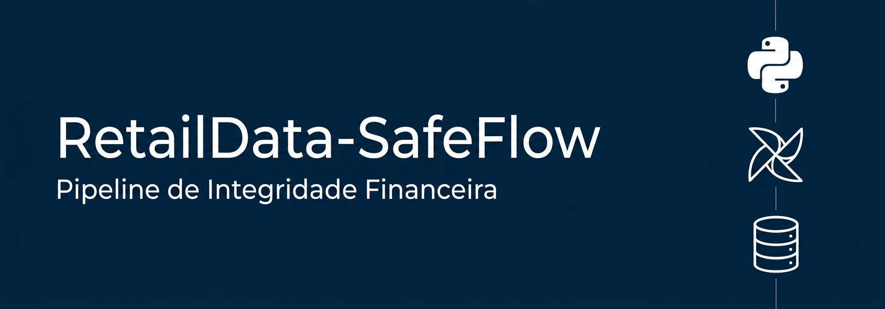

# 🛡️ RetailData-SafeFlow: Pipeline de Integridade Financeira

##  Por que este projeto existe? (Contexto de Negócio)
No setor de varejo, a tomada de decisão é baseada em volume de vendas e margens de lucro. Um erro comum é a presença de **dados sujos ou duplicados**, que podem levar a empresa a investir em campanhas de marketing erradas ou projetar lucros inexistentes.

Criei o **SafeFlow** para resolver o problema da "falta de confiança nos números". O objetivo não é apenas mover dados, mas garantir que cada linha de informação financeira que chega ao dashboard do gestor seja **auditada e confiável**.

##  Arquitetura e Solução Técnica
O pipeline foi desenhado seguindo as melhores práticas de **DataOps**:

*   **Ingestão**: Coleta de dados brutos de vendas (simulando PDVs de varejo).
*   **Orquestração (Airflow)**: O fluxo é automatizado para rodar em intervalos definidos, garantindo que os dados estejam sempre atualizados sem intervenção manual.
*   **Camada de Qualidade (Python/Pandas)**: 
    *   **Deduplicação Crítica**: Remoção de transações idênticas para não inflar o faturamento.
    *   **Saneamento**: Tratamento de valores nulos e correção de tipos de dados (Garantindo que datas sejam datas e valores sejam decimais).
*   **Carga (Load)**: Os dados limpos são estruturados para análise, prontos para alimentar modelos de previsão de demanda ou análise de marketing analytics.

##  Objetivos de Negócio
*   **Confiabilidade**: Garantir que o time de marketing e finanças trabalhe com dados 100% validados.
*   **Automação**: Eliminar processos manuais de limpeza de dados, reduzindo o risco de erro humano através da orquestração.
*   **Escalabilidade**: Estrutura modular preparada para crescer conforme o volume de vendas aumenta.

##  Tecnologias Utilizadas
*   **Python & Pandas**: Extração e transformação robusta de dados.
*   **Apache Airflow**: Orquestração e agendamento dos workflows.
*   **Docker**: Conteinerização para garantir um ambiente de execução isolado e estável.
*   **SQL**: Consultas e estruturação para persistência de dados.

##  Garantia de Qualidade e Integridade (Data Quality)

| Verificação | Descrição | Status |
| :--- | :--- | :--- |
| **Deduplicação** | Garante que não existam registros idênticos no pipeline. | ✅ Ativo |
| **Validação de Preço** | Filtra e corrige valores negativos ou inconsistentes. | ✅ Ativo |
| **Schema Check** | Verifica se as colunas estão no formato correto para o banco. | ✅ Ativo |
| **Orquestração** | Fluxo automatizado via Airflow para evitar erro humano. | ✅ Ativo |

##  Como Executar
1. Certifique-se de ter o **Docker** instalado.
2. Clone o repositório: `git clone https://github.com/YasmimLoppes/RetailData-SafeFlow.git`
3. Execute o comando: `docker-compose up` para iniciar o ambiente do Airflow.
4. Acesse a interface do Airflow e ative a DAG `retail_safeflow_pipeline`.

---
Desenvolvido por **Yasmim Lopes** | Focada em transformar dados brutos em inteligência de negócio robusta.
